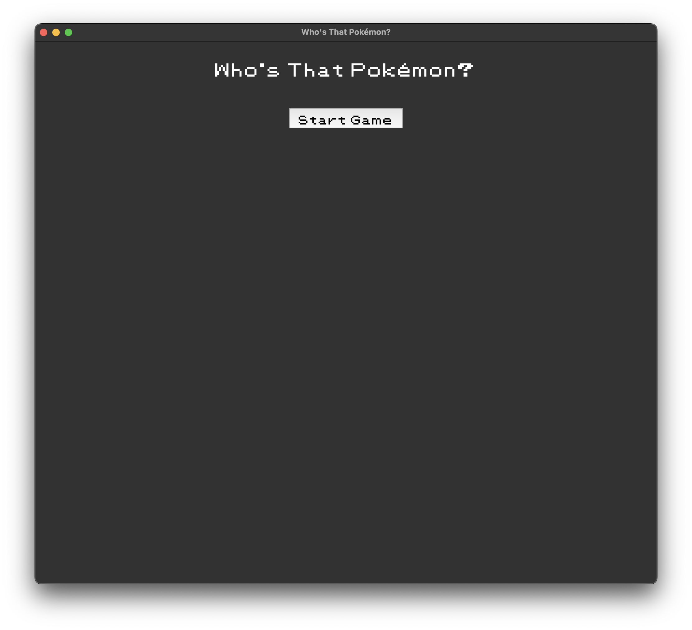
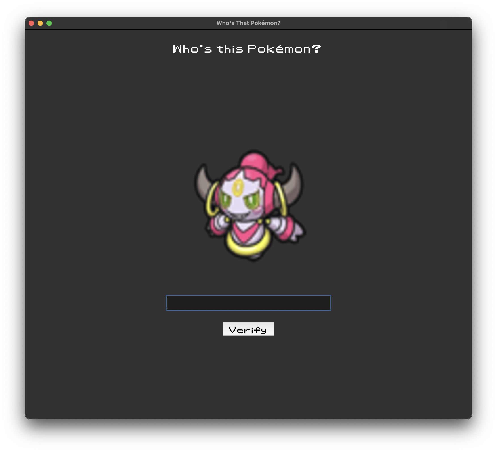
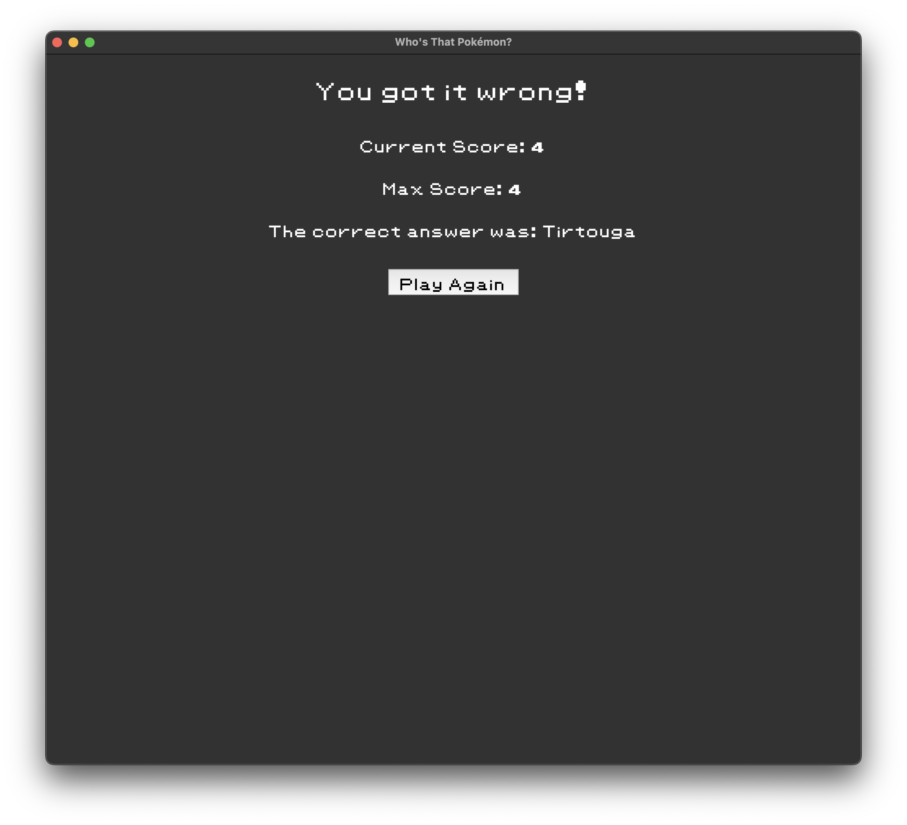
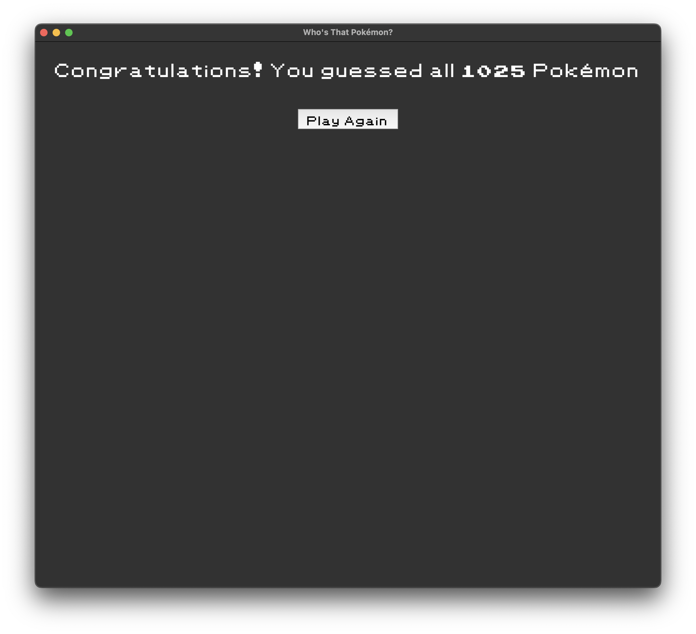

# Whos-That-Pokemon-Game
 Who's That Pokémon? A Python-based quiz game to guess Pokémon from images. Built with Tkinter, CSV, and PIL.

# Who's That Pokémon? 🐾
## About the Game
**"Who's That Pokémon?"** is a fun, interactive Python game that tests your Pokémon knowledge. Inspired by the classic segment from the Pokémon anime, this game challenges players to identify Pokémon based on their silhouette. Featuring **all 1025 Pokémon** from the Pokédex, it’s a great way to see how well you know your favorite Pokémon.

## Features
- Random Pokémon selection from the entire Pokédex.
- User-friendly interface built with Tkinter.
- Pokémon images displayed for you to guess.
- Keeps track of current and maximum score.
- Victory screen for when you correctly guess all Pokémon!
- Error screen that provides the correct answer if you make a mistake.

## Gameplay
- Click "Start Game" to begin.
- A Pokémon image will appear on screen.
- Type your guess in the text box and click "Verify".
- If you’re correct, you'll move on to the next Pokémon!
- If you’re incorrect, you'll see the error screen, your score, your highscore, and can try again.

## Installation
### Prerequisites
Ensure you have Python 3 installed along with the following packages:
- **Tkinter** (usually included with Python)
- **PIL** (Pillow) for image handling
- **csv** (standard library)
- **random** (standard library)
You can install Pillow using pip:
```
pip install Pillow
```
### Clone the repository
Clone the repository to your local machine using:
```
git clone https://github.com/yourusername/whos-that-pokemon-game.git
```
### Run the game
Navigate to the repository folder and run the game:
```
cd whos-that-pokemon-game
python whos_that_pokemon.py
```

## File Structure
- **whos_that_pokemon.py:** Main game script.
- **pokedex.csv:** CSV file containing Pokémon data.
- **images/:** Directory containing Pokémon images.
Make sure the images are correctly linked in `pokedex.csv` for the game to load Pokémon pictures properly.

## How it works
1. **pokedex.csv:** The game reads from `pokedex.csv` to load Pokémon names and image paths.
2. **Tkinter GUI:** Uses Tkinter to create a simple graphical interface.
3. **Random Selection:** A random Pokémon is chosen for each round.
4. **Victory & Error Screens:** Shows different screens based on whether your guess is correct or not.






## Contributing
Contributions are welcome! If you have ideas for improvements or find any bugs, please feel free to:
- Fork the repository.
- Create a new branch (`git checkout -b feature-branch`).
- Commit your changes (`git commit -m 'Add a new feature'`).
- Push to the branch (`git push origin feature-branch`).
- Create a **Pull Request**.

## License
This project is licensed under the MIT License - see the [LICENSE](LICENSE) file for details.

## Aknowledgements
- Pokémon images and data used in this game are the property of The Pokémon Company and Nintendo. This is a fan-made project for educational and entertainment purposes.
- Inspired by the original "Who's That Pokémon?" from the Pokémon anime series.

## Contact
Feel free to contact me via GitHub or open an issue if you encounter any problems or have questions.

Happy guessing, and may you catch 'em all! 🎉
